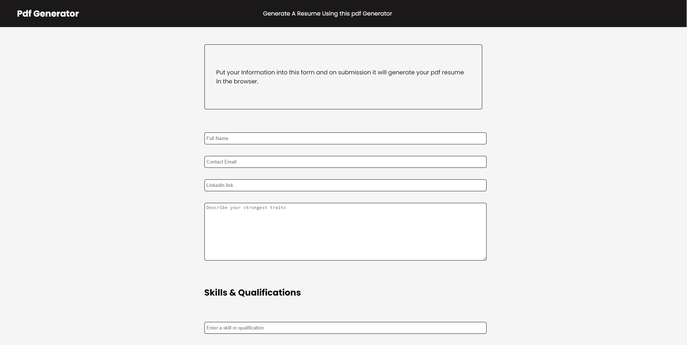
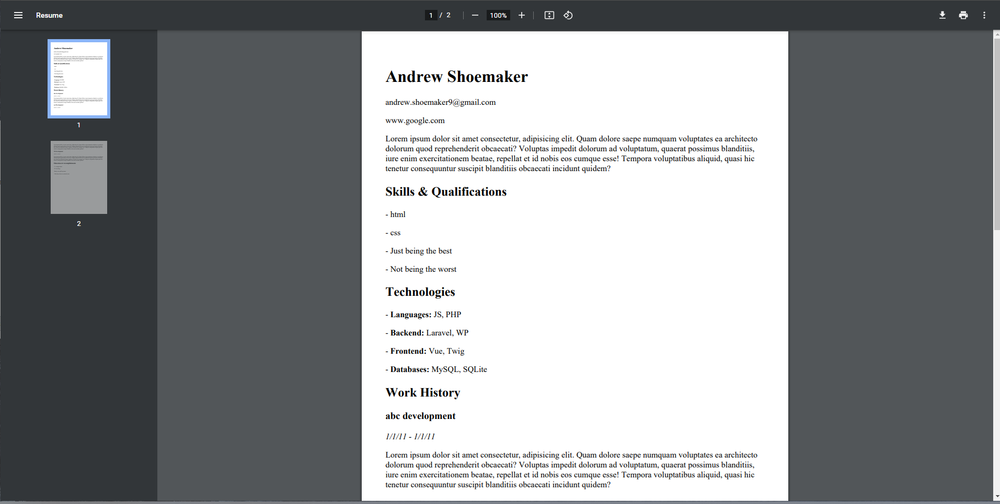

# Resume pdf generator

### Tech : HTML, CSS, PHP

This is a fairly small but fun project where I created a pdf generator that builds a resume based on user input that opens in the browser. 

### Example of generated Resume

